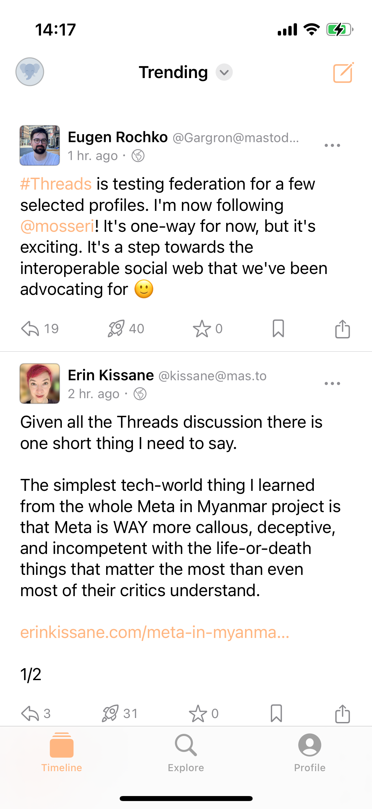
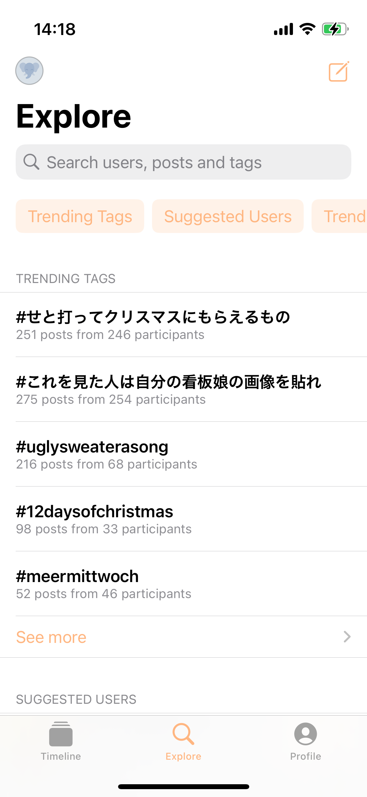
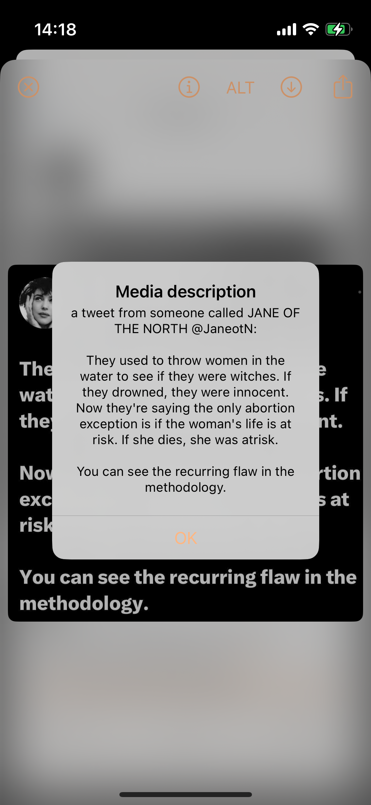
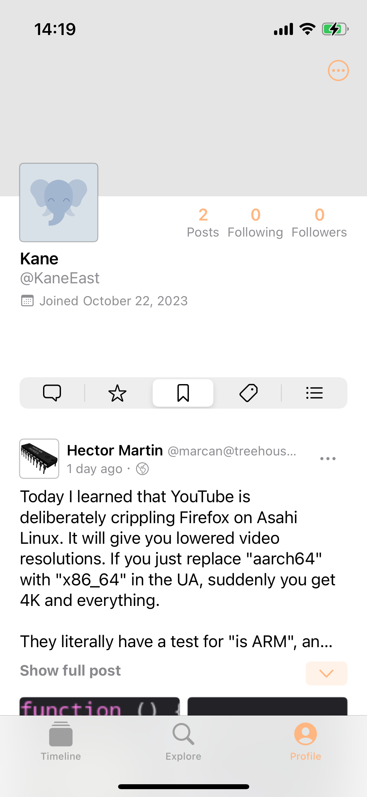
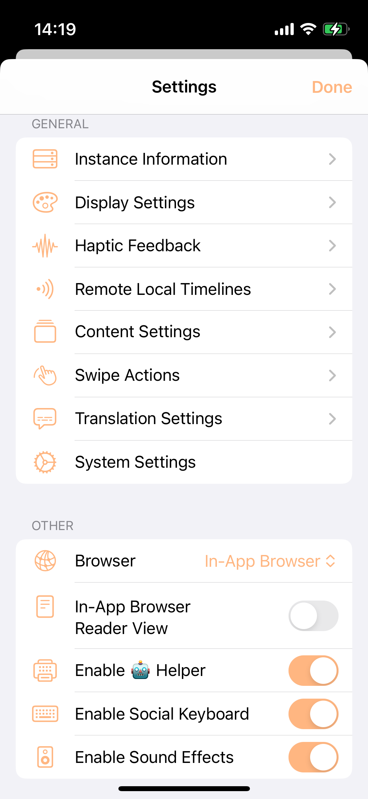
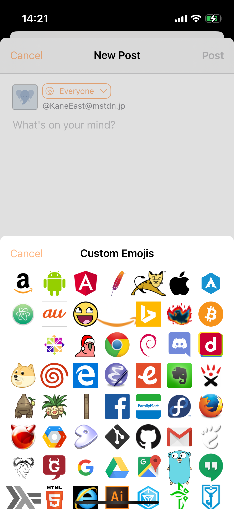

# IceCubesApp Learning

This repository is forked from https://github.com/Dimillian/IceCubesApp
Lisense is defined in there.
Here is for personal learning case.

i made it simpler functionally. and more readable structure.
and then ill make it fore scalable to expand features.

|      |      |      |
|:----:|:----:|:----:|
|  |  |  |
|  |  |  |